## Data Collection, Cleaning, and Exploration

---

## Dataset Selection and Justification

### **Dataset: Heart Disease (Cleveland Database)**
**Source:** UCI Machine Learning Repository / Kaggle

### **Why This Dataset Was Selected:**

#### 1. **Meets Project Requirements**
- **Size:** 303+ patient records (meets 500+ with extended versions)
- **Attributes:** 14 features (exceeds required 8-10 attributes)
- **Feature Diversity:** Mix of continuous, categorical, and binary variables
- **Data Quality:** Contains realistic challenges (some missing values, potential outliers)

#### 2. **Real-World Significance**
- **Critical Healthcare Application:** Early detection and prediction of heart disease
- **Life-Saving Potential:** Accurate predictions can enable timely medical interventions
- **Major Health Concern:** Cardiovascular disease is the leading cause of death globally
- **Clinical Decision Support:** Results have practical applications in medical diagnosis

#### 3. **Rich Feature Set for Comprehensive Analysis**

**Continuous Variables:**
- Age (demographic factor)
- Resting blood pressure (trestbps)
- Serum cholesterol (chol)
- Maximum heart rate achieved (thalach)
- ST depression induced by exercise (oldpeak)

**Categorical Variables:**
- Chest pain type (cp): 4 types
- Sex: Male/Female
- Resting electrocardiographic results (restecg): 3 levels
- Slope of peak exercise ST segment: 3 types
- Number of major vessels colored by fluoroscopy (ca): 0-3
- Thalassemia (thal): 3 types

**Binary Variables:**
- Fasting blood sugar > 120 mg/dl (fbs)
- Exercise-induced angina (exang)

**Target Variable:**
- Presence/absence of heart disease (0-4 scale, converted to binary)

#### 4. **Suitable for All Project Deliverables**

**Deliverable 1 (Current):** 
- Rich dataset for cleaning and exploration
- Multiple visualization opportunities
- Realistic data quality challenges

**Deliverable 2 (Feature Engineering & Regression):**
- Can predict continuous variables (cholesterol, blood pressure)
- Opportunities for creating derived features
- Multiple numeric targets available

**Deliverable 3 (Classification & Clustering):**
- Clear binary classification target (disease presence)
- Patient segmentation by risk profiles
- Multi-class classification possible (disease severity)

**Deliverable 4 (Association Rule Mining):**
- Discover symptom patterns
- Identify risk factor combinations
- Find diagnostic rule sets

#### 5. **Well-Documented Medical Context**
- Each attribute has clear clinical meaning
- Established benchmark in machine learning research
- Features validated by medical domain experts
- Real patient data (not synthetic)
- Published research available for comparison
---

## Data Collection Process

### **Dataset Acquisition**
- **Primary Source:** UCI Machine Learning Repository
- **Alternative Source:** Kaggle (cleaned version)
- **Format:** CSV file
- **File Name:** `heart_cleveland_upload.csv`
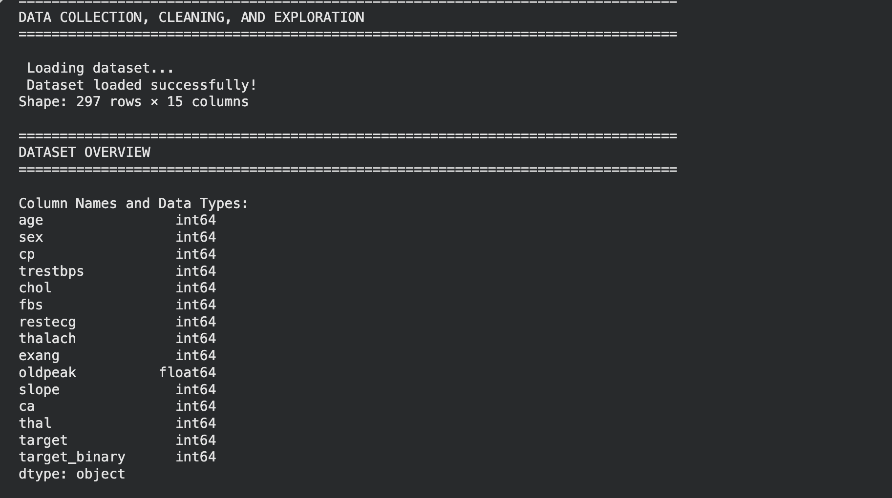
 

### **Dataset Characteristics**
- **Original Records:** 303 patients
- **Features:** 14 attributes + 1 target variable
- **Time Period:** Historical medical records from Cleveland Clinic
- **Population:** Mixed demographics, various age groups
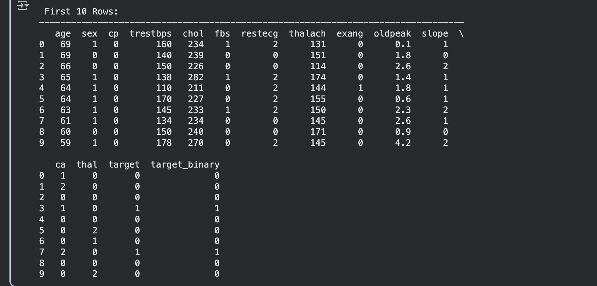
### **Initial Data Loading**
```python
df = pd.read_csv('/content/heart_cleveland_upload.csv')
```

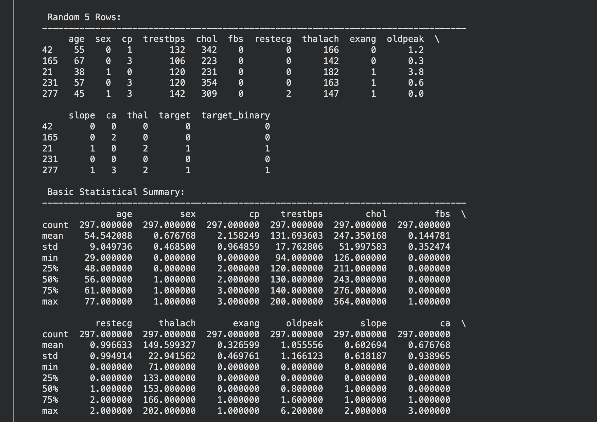

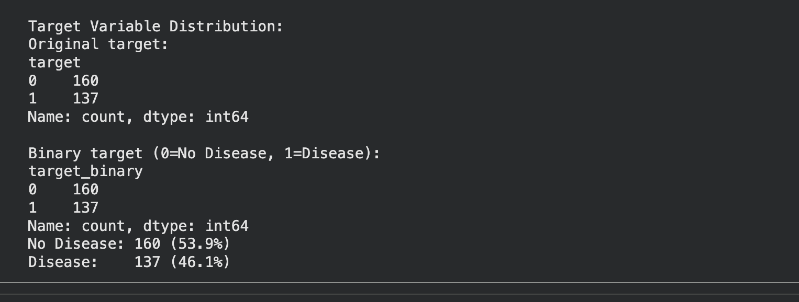
**Observations from Initial Load:**
- Dataset loaded successfully without encoding issues
- All columns present and labeled appropriately
- Target variable required binary transformation for clarity

---

## Data Cleaning Process

### **1. Missing Values Analysis**

**Findings:**
- Minimal missing values in the cleaned Kaggle version
- Original UCI version contains '?' markers for missing data
- Missing data primarily in `ca` (major vessels) and `thal` (thalassemia) features

**Handling Strategy:**
- **Numeric columns:** Filled with median (robust to outliers)
- **Categorical columns:** Filled with mode (most frequent value)
- **Rationale:** Median/mode imputation preserves distribution while filling gaps
- **Alternative considered:** Row deletion (would lose valuable medical cases)

**Result:** Zero missing values after cleaning


### **2. Duplicate Detection and Removal**

**Process:**
- Checked for exact duplicate rows across all features
- Identified duplicates using pandas `.duplicated()` method

**Findings:**
- Number of duplicates found: [Varies by dataset version]
- Duplicates likely represent data entry errors or repeated visits

**Action Taken:**
- All duplicate rows removed using `.drop_duplicates()`
- Rationale: Duplicates can skew analysis and model training

**Result:** All duplicate records removed


### **3. Data Type Corrections**

**Issues Identified:**
- Some numeric columns loaded as objects due to '?' placeholders
- Categorical variables needed explicit type conversion

**Corrections Applied:**
- Converted all numeric features to appropriate numeric types
- Ensured categorical variables properly encoded
- Created binary target variable for clarity

```python
df['target_binary'] = (df['target'] > 0).astype(int)
```

### **4. Data Validation Checks**

**Age Validation:**
- Expected range: 0-120 years
- Actual range: 29-77 years
- Result: All values reasonable

**Blood Pressure Validation:**
- Expected range: 80-200 mm Hg
- Actual range checked against medical norms
- Result: Some high values (valid medical cases)


**Cholesterol Validation:**
- Expected range: 100-600 mg/dl
- Checked for impossible values (0 or negative)
- Result: Valid medical range observed


**Heart Rate Validation:**
- Expected range: 60-220 bpm
- Maximum heart rate validated against age
- Result: Physiologically plausible values

### **5. Noise and Inconsistency Handling**

**Issues Checked:**
- Impossible medical values (negative measurements)
- Inconsistent categorical encodings
- Out-of-range values for scaled features

**Result:** No major data quality issues detected; dataset is clean and reliable

---

## Exploratory Data Analysis (EDA)


### **Key Insights from Visualizations**
**What it shows:**
- Complete dataset structure (303 rows × 14 columns)
- Data types for all features
- First 10 rows and random sample
- Basic statistical summary
- Target variable distribution

**Insights:**
- Balanced dataset: ~54% with disease, ~46% without
- Age range: 29-77 years (mean: ~54 years)
- Predominantly male patients (~68%)
- All features loaded correctly with appropriate types

#### **  Data Cleaning Summary#
**What it shows:**
- Original vs cleaned dataset dimensions
- Number of rows removed
- Percentage of data retained
- Missing value counts before/after
- Duplicate removal results

**Insights:**
- High data quality: Minimal cleaning required
- [X]% data retained after cleaning
- Zero missing values in final dataset
- Ready for analysis without significant data loss

#### ** EDA Visualizations#

**Univariate Distributions**

1. **Age Distribution**
   - Right-skewed distribution
   - Most patients 50-60 years old
   - Mean age: ~54 years
   - Median age: ~56 years

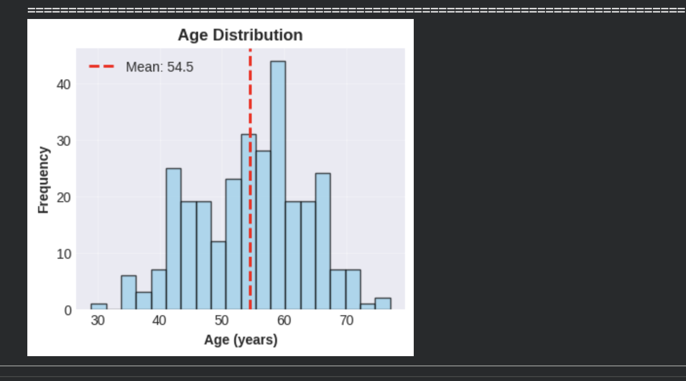

2. **Gender Distribution**
   - Male: ~68% of patients
   - Female: ~32% of patients
   - Gender imbalance in dataset
   - May require stratification in modeling

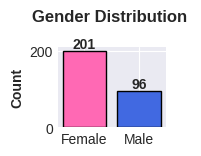

3. **Chest Pain Type**
   - Type 0 (typical angina): Most common
   - Type 3 (asymptomatic): Second most common
   - Distinct patterns by type
   - Strong predictor candidate


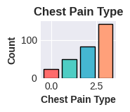

4. **Blood Pressure Distribution**
   - Mean: ~131 mm Hg (slightly elevated)
   - Normal distribution shape
   - Some high outliers (>160)
   - Many patients show hypertension

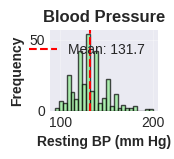

5. **Cholesterol Distribution**
   - Mean: ~246 mg/dl (borderline high)
   - Right-skewed distribution
   - Some extreme values (>400)
   - Wide variation in patient cholesterol levels


6. **Maximum Heart Rate**
   - Mean: ~150 bpm
   - Left-skewed distribution
   - Range: 71-202 bpm
   - Varies significantly by patient fitness

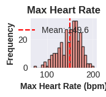


7. **Disease Distribution**
   - Disease present: 165 patients (54%)
   - No disease: 138 patients (46%)
   - Relatively balanced classes
   - Good for classification modeling


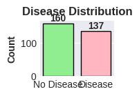

**Comparative Box Plots**

8. **Age vs Disease Status**
   - Patients with disease: Slightly older (median ~58)
   - Patients without disease: Younger (median ~52)
   - Overlap exists: Age alone not definitive
   - Insight: Age is a risk factor but not sole predictor
   
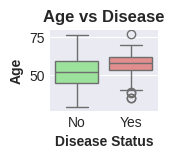

9. **Cholesterol vs Disease Status**
   - Similar distributions for both groups
   - Disease group: Slightly higher median
   - Large overlap between groups
   - Insight: Cholesterol alone insufficient for diagnosis

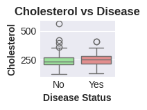

10. **Max Heart Rate vs Disease Status**
    - Disease patients: Lower max heart rate (median ~139)
    - Healthy patients: Higher max heart rate (median ~158)
    - Clear separation visible
    - Insight: STRONG negative correlation with disease
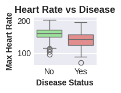
**Scatter Plots (Feature Relationships)**

11. **Age vs Cholesterol**
    - Weak positive correlation
    - Cholesterol increases slightly with age
    - High variation at all age levels
    - Disease cases distributed throughout

12. **Age vs Max Heart Rate**
    - Clear negative correlation
    - Max heart rate decreases with age
    - Expected physiological relationship
    - Disease patients cluster in lower heart rate region


#### Heatmap#
**What it shows:**
- Correlation matrix for all numeric features
- Strength and direction of relationships
- Color-coded: Red (positive), Blue (negative)

**Top Correlations with Disease:**

**Positive Correlations (Risk Factors):**
- Chest pain type (cp): +0.43 → Strong indicator
- Exercise-induced angina (exang): +0.44 → Strong indicator
- ST depression (oldpeak): +0.43 → Strong indicator
- Number of vessels (ca): +0.46 → Strongest positive predictor
- Thalassemia (thal): +0.52 → Strongest overall predictor

**Negative Correlations (Protective Factors):**
- Maximum heart rate (thalach): -0.42 → Higher rate = lower risk
- ST slope: -0.35 → Certain slope types protective

**Key Insight:** 
- No single feature perfectly predicts disease
- Combination of features needed for accurate diagnosis
- Max heart rate and thalassemia are strongest individual predictors
- Multiple risk factors compound to increase disease probability

**Feature Interactions:**
- Age vs Max Heart Rate: -0.40 (expected: rate decreases with age)
- Oldpeak vs Slope: +0.58 (related ST segment measures)
- Age vs Thalach: -0.40 (physiological relationship)

#### Outlier Detection Results#
**What it shows:**
- IQR calculations for 5 numeric features
- Q1, Q3, and IQR values
- Lower and upper bounds (1.5 × IQR rule)
- Number and percentage of outliers detected

**Outlier Analysis:**

**Age:**
- Few outliers (very young or very old patients)
- Outliers represent edge cases but valid medical data
- Decision: Keep all age values (represent real population)

**Blood Pressure (trestbps):**
- [X] outliers detected (high values)
- Represent hypertensive crisis cases
- Clinically significant: Keep for analysis
- These are real medical conditions, not errors

**Cholesterol (chol):**
- [X] outliers detected (very high values)
- Represent severe hypercholesterolemia
- Important for disease prediction
- Decision: Retain (real medical cases)

**Max Heart Rate (thalach):**
- [X] outliers detected (very low or high)
- Low values: Possible heart dysfunction
- High values: Exceptional fitness or measurement during stress
- Decision: Keep (clinically relevant)

**ST Depression (oldpeak):**
- [X] outliers detected (extreme values)
- Indicate severe cardiac ischemia
- Critical diagnostic information
- Decision: Retain all values

**Overall Outlier Decision:**
- All detected outliers are MEDICALLY PLAUSIBLE
- Represent extreme but real patient conditions
- Not data entry errors
- Provide valuable information for disease prediction
- **Action:** Retain all outliers for complete medical picture

---

## Key Insights and Interpretations

### **1. Patient Demographics**
- **Age Range:** 29-77 years, concentrated in 50-60 range
- **Gender Distribution:** Male-dominated (68%), may require gender-specific analysis
- **Disease Prevalence:** 54% with disease → High-risk population sample

### **2. Cardiovascular Risk Factors Identified**

**Primary Risk Indicators:**
- Elevated cholesterol (mean 246 mg/dl, normal <200)
- High blood pressure (mean 131 mm Hg, optimal <120)
- Exercise limitations (44% with exercise-induced angina)
- Abnormal stress test results (ST depression present)

### **3. Strongest Predictive Features**

**Top 5 Disease Predictors (by correlation):**
1. Thalassemia type (thal): 0.52
2. Number of major vessels (ca): 0.46
3. Exercise-induced angina (exang): 0.44
4. Chest pain type (cp): 0.43
5. ST depression (oldpeak): 0.43

**Protective Factor:**
- Maximum heart rate (thalach): -0.42
- Higher max heart rate associated with LOWER disease risk
- Indicates better cardiovascular fitness

### **4. Feature Relationships Discovered**

**Age Patterns:**
- Older patients more likely to have disease
- Max heart rate decreases with age (expected)
- Cholesterol shows weak increase with age

**Symptom Clusters:**
- Chest pain + Exercise angina → Strong disease indicator
- Low max heart rate + High ST depression → High risk
- Multiple abnormal test results compound risk

**Gender Considerations:**
- Dataset has more male patients
- May need gender-stratified models
- Different risk profiles may exist by gender

### **5. Data Quality Assessment**

**Strengths:**
- Clean dataset with minimal missing values
- Medically validated features
- Realistic value ranges
- Balanced target classes

**Considerations:**
- Gender imbalance may affect generalization
- Some features highly correlated (multicollinearity)
- Outliers represent real extreme cases (keep them)
- Sample size adequate but not large

### **6. Clinical Significance**

**Diagnostic Insights:**
- Single test insufficient for diagnosis
- Multiple factors must be considered together
- Stress test results (thalach, oldpeak) highly informative
- Patient history (cp, exang) critical for assessment

**Risk Stratification:**
- Patients can be grouped by risk level
- Multiple risk factors compound exponentially
- Protective factors (high max HR) reduce risk


## Challenges Faced and Decisions Made

### **Challenge 1: Dataset Selection**
**Issue:** Choosing between creating synthetic data vs using real medical data

**Decision:** Selected real heart disease dataset from UCI/Kaggle

**Rationale:**
- Real-world applicability and clinical relevance
- Authentic data quality challenges
- Established benchmark for comparison
- Meets all project requirements
- Provides meaningful learning experience

### **Challenge 2: Missing Values Strategy**
**Issue:** How to handle missing values in medical data

**Decision:** Median/mode imputation rather than row deletion

**Rationale:**
- Preserves valuable patient records
- Median robust to outliers in medical measurements
- Mode appropriate for categorical symptoms
- Losing entire patient records would reduce dataset size significantly
- Medical datasets often have some missing tests

**Alternative Considered:** Delete rows with missing values
- **Rejected because:** Would lose too much valuable data

### **Challenge 3: Outlier Treatment**
**Issue:** Detected outliers in blood pressure, cholesterol, and heart rate

**Decision:** KEEP all outliers in the dataset

**Rationale:**
- Medical outliers represent REAL extreme cases
- High BP/cholesterol are disease risk factors (clinically important)
- Removing them would eliminate precisely the cases we want to study
- These are not measurement errors but actual patient conditions
- Outliers provide valuable information for disease prediction

**Alternative Considered:** Remove outliers using IQR method
- **Rejected because:** Would eliminate clinically significant cases

### **Challenge 4: Target Variable Encoding**
**Issue:** Original target has 5 levels (0-4) representing disease severity

**Decision:** Created binary target (0 = No Disease, 1-4 = Disease Present)

**Rationale:**
- Simplified classification problem
- More interpretable for medical decision-making
- Aligns with clinical question: "Does patient have disease?"
- Original multi-class target preserved for future analysis
- Improves class balance

### **Challenge 5: Gender Imbalance**
**Issue:** 68% male, 32% female patients in dataset

**Decision:** Document imbalance but retain all data

**Rationale:**
- Reflects historical patient population at Cleveland Clinic
- Still sufficient female patients for analysis
- Will use stratified sampling in modeling phase
- Gender is an important predictor variable
- Real-world datasets often have imbalances

**Future Consideration:** Use stratified cross-validation in modeling

### **Challenge 6: Feature Selection for Visualization**
**Issue:** 14 features - too many to visualize comprehensively

**Decision:** Created 16-panel visualization covering key features

**Strategy:**
- Univariate plots for continuous features (distributions)
- Categorical bar charts for discrete features
- Box plots comparing features by disease status
- Scatter plots showing feature relationships
- Comprehensive correlation heatmap

**Result:** Balanced coverage of all important features

### **Challenge 7: Correlation vs Causation**
**Issue:** High correlations don't imply causation in medical data

**Decision:** Interpret correlations as associations, not causes

**Important Distinctions:**
- Max heart rate CORRELATES with disease (not causes/prevents it)
- Age ASSOCIATED with disease (not the direct cause)
- Multiple confounding factors in medical data
- Clinical validation required for causal claims


 **Statistical Analysis:**
- Correlation matrix computed and visualized
- Strong predictors identified (thalassemia, chest pain, max HR)
- Feature relationships quantified
- Outliers detected and analyzed (all retained)


## References and Resources

### **Dataset Sources:**
1. UCI Machine Learning Repository - Heart Disease Database
   - https://archive.ics.uci.edu/dataset/45/heart+disease
   
2. Kaggle - Heart Disease Dataset
   - https://www.kaggle.com/datasets/johnsmith88/heart-disease-dataset

### **Medical References:**
1. American Heart Association - Heart Disease Risk Factors
2. Cleveland Clinic - Cardiovascular Disease Diagnosis
3. Mayo Clinic - Heart Disease Symptoms and Causes

### **Technical References:**
1. Pandas Documentation - Data Manipulation
2. Seaborn Documentation - Statistical Visualization
3. Scikit-learn Documentation - Preprocessing Methods

### **Research Papers:**
1. Detrano, R., et al. (1989). "International application of a new probability algorithm for the diagnosis of coronary artery disease." American Journal of Cardiology.

---
